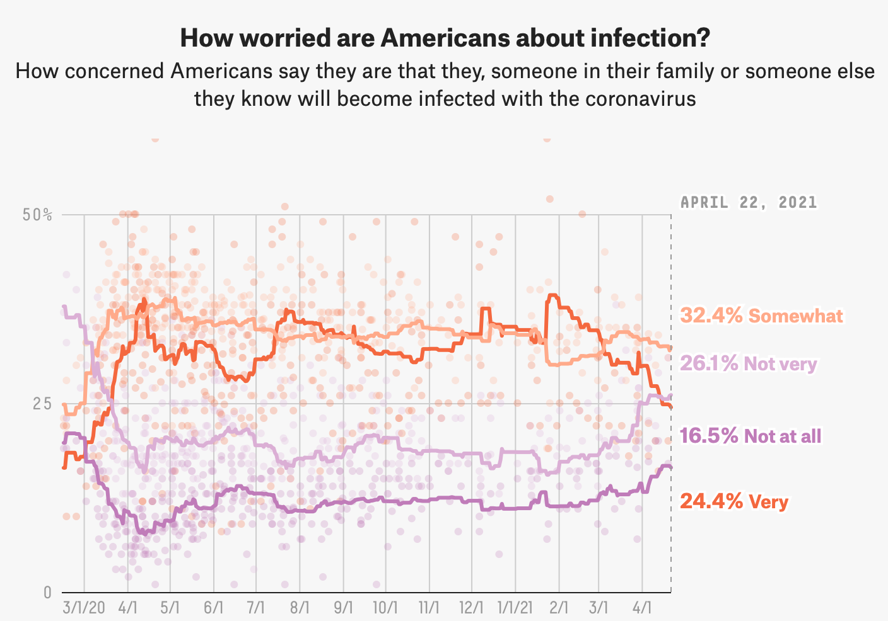

This section focused on recreating a graph from a project from *Fivethirtyeight*
 entiteled *How Americans View Biden's Response To The Coronavirus Crisis*. 
 

[Project Information](https://projects.fivethirtyeight.com/coronavirus-polls/)

 

### Loading packages
```{r}
library(tidyverse)
library(ggplot2)
library(dplyr)
library(here)
library(readr)
library(tibble)
library(lubridate)
library(tidyverse)
```

### Data import 
Import the dataset into R 
```{r}
#The graph contains 2 data sets.

data1 <- here::here("data", "covid_concern_polls_adjusted.csv")
Data1 <- read.csv(data1)

data2<- here::here("data", "covid_concern_toplines.csv")
Data2 <- read.csv(data2)

str(Data1)
str(Data2)

glimpse(Data1)

```
### Cleaning the data 
```{r}
concern <- Data1 %>%
  filter(subject == "concern-infected") %>%
  select(startdate, very_adjusted, somewhat_adjusted, not_very_adjusted,	not_at_all_adjusted)
```
### Covert date format with lubridate package
```{r}
 concern$startdate <- mdy(concern$startdate )
```
### Creating PLOT 1
```{r}
Plot_concern<-ggplot()+
  geom_point(data = concern, mapping=aes(x=startdate , y= very_adjusted),  
  alpha=0.2, color="#FF4C00") +
  
  geom_point(data = concern, mapping=aes(x=startdate , y= somewhat_adjusted), 
  alpha=0.2, color="#FCBE85") +
  
  geom_point(data = concern, mapping=aes(x=startdate , y= not_very_adjusted), 
  alpha=0.2, color="#B19CD9") +
  
  geom_point(data = concern, mapping=aes(x=startdate , y= not_at_all_adjusted),   alpha=0.2, color="#8B008B") +

  xlab(" ") + 
  ylab(" ") + scale_y_continuous(limits= c(0, 50), breaks=c(0, 25, 50), labels=c("0", "25", "50%"))

print(Plot_concern)
```

### Data 2 (Lines)
#Filter by "concern-infected"
```{r}
infected <- Data2 %>%
       filter(subject=="concern-infected") %>%
       select(subject, modeldate, very_estimate, somewhat_estimate, not_very_estimate,
       not_at_all_estimate)

### Covert date format with lubridate package
infected$modeldate <- mdy(infected$modeldate)
```
###Creating the plot
```{r}
#Color-Hex Code
#LightPurple = #B19CD9
#Darkmagenta = #8B008B
#Orange = #FF4C00
#Baby orange = #FCBE85

p1<- ggplot()+   
geom_line(data=infected, mapping=aes(x=modeldate, y=very_estimate), color="#FF4C00") +
  
geom_line(data=infected, mapping=aes(x=modeldate, y=somewhat_estimate), color="#FCBE85") +
  
geom_line(data=infected, mapping=aes(x=modeldate, y=not_very_estimate), color="#B19CD9") +
  
geom_line(data=infected, mapping=aes(x=modeldate, y=not_at_all_estimate), color="#8B008B") +
  
  xlab(" ") + 
  ylab(" ") + scale_y_continuous(limits= c(0, 50), breaks=c(0, 25, 50), labels=c("0", "25", "50%"))

print (p1)
  
```

#Its time to combine both plots Plot_concern + p1 (Lines)
```{r}
Final_Graph <- ggplot()+
  geom_point(data = concern, mapping=aes(x=startdate , y= very_adjusted),  
  alpha=0.2, color="#FF4C00") +
  
  geom_point(data = concern, mapping=aes(x=startdate , y= somewhat_adjusted), 
  alpha=0.2, color="#FCBE85") +
  
  geom_point(data = concern, mapping=aes(x=startdate , y= not_very_adjusted), 
  alpha=0.2, color="#B19CD9") +
  
  geom_point(data = concern, mapping=aes(x=startdate , y= not_at_all_adjusted), 
  alpha=0.2, color="#8B008B") +
  
  geom_line(data=infected, mapping=aes(x=modeldate, y=very_estimate), color="#FF4C00") +
  
  geom_line(data=infected, mapping=aes(x=modeldate, y=somewhat_estimate), color="#FCBE85") +
  
  geom_line(data=infected, mapping=aes(x=modeldate, y=not_very_estimate), color="#B19CD9") +
  
  geom_line(data=infected, mapping=aes(x=modeldate, y=not_at_all_estimate), color="#8B008B") +
  
  xlab(" ") + 
  ylab(" ") + scale_y_continuous(limits= c(0, 50), breaks=c(0, 25, 50), labels=c("0", "25", "50%"))+ 

   theme_light(base_size = 12, base_family = "mono") +

    scale_x_date( date_breaks = "1 month", date_labels = "%m/%d")  +
    annotate(geom = "text", x = as.Date("2021-04-01"), y =35,
           label = "32.4% Somewhat",
           color = "#FCBE85",
           size = 4,
           fontface = 1,
           vjust = 1,
           hjust = 0) +
    annotate("text", x = as.Date("2021-04-01"), y = 12, 
           label = "24.4% Very", 
           color = "#FF4C00", 
           size = 4, 
           fontface = 2,
           vjust = 1,
           hjust = 0) +
    annotate("text", x = as.Date("2021-04-01"), y = 26, 
           label = "26.1% Not Very", 
           color = "#B19CD9", 
           size = 4, 
           fontface = 2,
           vjust = 1,
           hjust = 0) +
  
    annotate("text", x = as.Date("2021-04-01"), y = 22, 
           label = "16.5% Not at all", 
           color = "#8B008B", 
           size = 4, 
           fontface = 2,
           vjust = 1,
           hjust = 0) 
  
    
print(Final_Graph)
```


